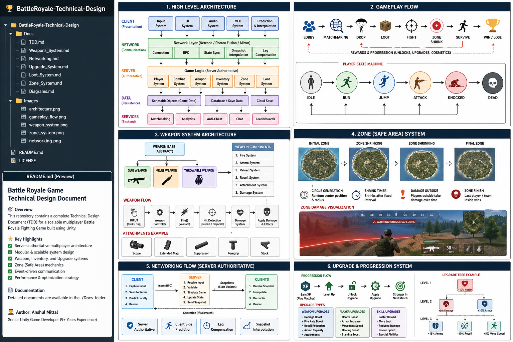

# 🎮 Battle Royale Game – Technical Design & Agile Execution

---

## 🚀 Overview

This repository showcases a **production-level Technical Design Document (TDD)** for a scalable **Battle Royale Multiplayer Game**, along with **Agile/Scrum execution artifacts**.

The goal of this project is to demonstrate:

* System design thinking
* Scalable architecture
* Multiplayer understanding
* Real-world Agile workflow

---

## 🏗️ High-Level Architecture

### 🔹 Key Highlights

* Server-authoritative multiplayer model
* Modular & scalable system design
* Event-driven architecture
* Data-driven approach (ScriptableObjects)

---

## 🎮 Gameplay Flow

**Loop:**
Lobby → Matchmaking → Drop → Loot → Fight → Zone Shrink → Survive → Win/Lose

---

## 🔫 Weapon System

### Features:

* Multiple weapon types (Gun, Melee, Throwable)
* Recoil, reload, and ammo system
* Attachment-based upgrades

---

## ⭕ Zone System

### Features:

* Dynamic shrinking safe zone
* Damage outside zone
* High-intensity endgame

---

## 🌐 Networking Architecture

### Approach:

* Server authoritative
* Client prediction
* Snapshot interpolation
* Lag compensation

---

## 📈 Upgrade & Progression System

* Weapon upgrades (damage, recoil, ammo)
* Player upgrades (health, speed, armor)
* Skill-based progression

---

## 🎁 Loot System

* Randomized loot spawning
* Rarity tiers (Common → Legendary)
* Zone-based loot balancing

---

# 🧠 System Design Documentation

Detailed documentation available in `/Docs`:

* 📄 TDD.md
* 🔫 Weapons_System.md
* 🌐 Networking.md
* 📈 Upgrade_System.md
* 🎁 Loot_System.md
* ⭕ Zone_System.md
* 📊 Diagrams.md

---

# 🔄 Agile & Scrum Execution

This project also demonstrates **real-world Agile workflow**.

---

## 📊 Scrum Board

.png)

---

## 📉 Sprint Burndown Chart

.png)

---

## 📈 Team Velocity

.png)

---

## 🧩 Sprint Planning

* Sprint 1: Core Gameplay Systems
* Sprint 2: Gameplay Expansion Systems

---

## 📋 Agile Artifacts

Available in `/Agile`:

* Scrum Process
* Product Backlog
* Sprint Backlog
* User Stories
* Story Points Estimation
* JIRA-style Tickets

---

# ⚡ Performance Strategy

* Object pooling
* LOD & occlusion culling
* Tick-based updates
* Network optimization

---

# 🔐 Security Considerations

* Server-side validation
* Anti-cheat mechanisms
* Input verification

---

# 🧪 Testing Strategy

* Multiplayer stress testing
* Latency simulation
* Device performance testing

---

# 🚀 Future Scope

* Dedicated server deployment
* Cross-platform multiplayer
* LiveOps & seasonal content
* Advanced AI bots

---

# 👨‍💻 Author

**Anshul Mittal**
Senior Unity Game Developer (9+ Years Experience)

---

# 📌 Note

This repository focuses on **system design, architecture, and process**, not a complete playable game.

Future updates may include:

* Unity prototype implementation
* Playable demo systems

---

# ⭐ If you find this useful

Feel free to ⭐ the repo or connect with me!
